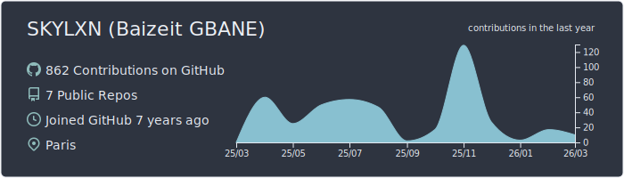
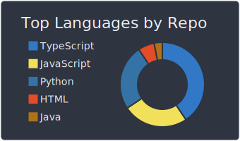
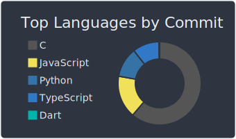
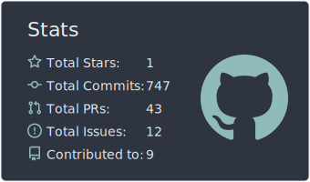
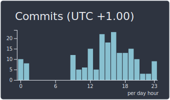

# 💫 About Me

### 🚀 Hi there, I'm Baizeit Gbane 👋
**Technical Product Manager | Data Intelligence & AI Builder**

I am a Product Manager with a strong technical foundation, holding a Master's degree in Data Intelligence. I specialize in bridging the gap between business strategy and engineering, building 0→1 products, and leveraging data (SQL/Python) to drive actionable decisions.

---

* 🔭 **I’m currently working on:** Delivering AI/LLM POCs and robust API integrations for B2B SaaS platforms to optimize complex operational workflows.
* 👯 **I’m looking to collaborate on:** Innovative 0→1 AI products, open-source data tools, and technical initiatives focused on solving hard operational constraints.
* 🤝 **I’m looking for help with:** Exploring advanced Agentic AI frameworks and scaling serverless applications for SMBs.
* 🌱 **I’m currently learning:** Advanced prompt engineering, autonomous AI agent development, and rapid prototyping to accelerate product delivery.
* 💬 **Ask me about:** Agile Product Management, reducing LLM hallucinations, SQL data extraction, API/SDK integrations, and translating user pain points into highly technical user stories.
* ⚡ **Fun fact:** I previously lived in Seoul, and I co-founded a non-profit organization centered around football and social inclusion!

# 💻 Tech Stack:
                                                                                     

# 📊 GitHub Stats:

  
  

### ✍️ Random Dev Quote

---

<!-- Proudly created with GPRM ( https://gprm.itsvg.in ) -->
